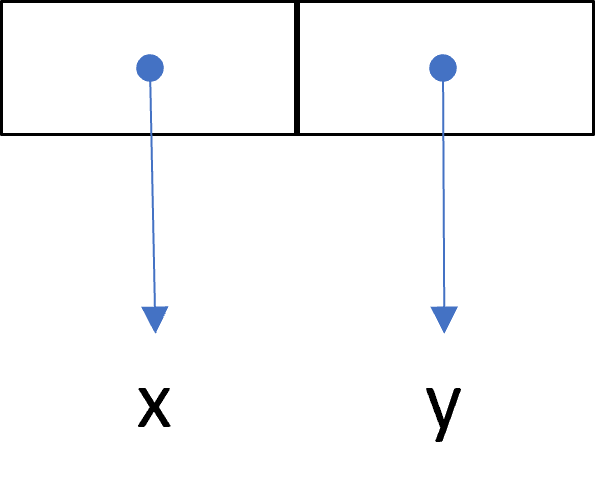
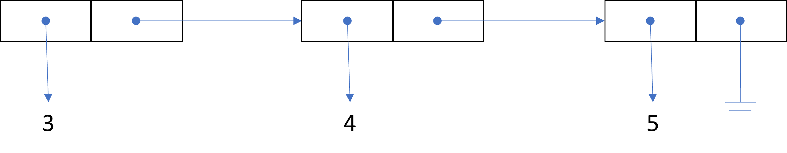

# Lists and Recursion in Racket

[Racket] has good built-in support for *singly-linked lists*, and it's the
data structure we'll use most frequently. [Racket] functions are themselves
lists, a feature known as
[homoiconicity](https://en.wikipedia.org/wiki/Homoiconicity). Because of this,
it's relatively easy to write [Racket] programs that manipulate other [Racket]
programs.

[Racket] supports vectors, strings, and hash tables as well, but we will
almost never use those.

## Making Lists

Lists can be created in a number of different ways. Two common ways are the
`list` function, and quoting:

```scheme
> (list 1 2 3)
'(1 2 3)
> '(1 2 3)
'(1 2 3)

> (list 'a 'b 'c)
'(a b c)
> '(a b c)
'(a b c)

> (list 'my 'dog 'has 'fleas)
'(my dog has fleas)
> '(my dog has fleas)
'(my dog has fleas)

> (list 'my 'dog (list 'and 'hamster) 'have 10 'fleas 'each)
'(my dog (and hamster) have 10 fleas each)
> '(my dog (and hamster) have 10 fleas each)
'(my dog (and hamster) have 10 fleas each)
```

The last example shows a [Racket] list can contain *any type of value*, even
other lists. The values on a list do *not* need to be the same type.

Since `list` is a function, it's useful when you want to evaluate expressions
*before* putting them on the list, e.g.:

```scheme
> (list (+ 1 2) (* 3 4) (- 5 6))
'(3 12 -1)
```

The **empty list** is a list with 0 values, and is written as `'()`. Use
`null?` or `empty?` to test if a list is empty:

```scheme
> (null? '(1 2))
#f
> (null? '())
#t

> (empty? '(1 2))
#f
> (empty? '())
#t
```

> **Aside** Some versions of LISP write `()` for the empty list, i.e. without
> the quote. But not [Racket]. The empty list always starts with a `'`.


## List Processing

[Racket] has many useful built-in list processing functions. 

The `first` function returns the first element of a list:

```scheme
> (first '(1 2 3))
1
> (first '((1 2) 3 4))
'(1 2)
> (first '(my dog has fleas))
'my
> (first '())
. . first: contract violation
  expected: (and/c list? (not/c empty?))
  given: '()
```

The empty list has no first element, so `(first '())` is an error.

The `rest` function returns everything on a list *except* for the first
element:

```scheme
> (rest '(1 2 3))
'(2 3)

> (rest '((1 2) 3 4))
'(3 4)

> (rest '(my dog has fleas))
'(dog has fleas)

> (rest '())
. . rest: contract violation
  expected: (and/c list? (not/c empty?))
  given: '()
```

> **Aside** `first` and `rest` were *not* the function names used in the
> original version of [Lisp]. Instead, `car` was the name for `first`, and
> `cdr` was the name for `rest`. These unusual names referred to the
> underlying hardware of the original computer on which [Lisp] was originally
> implemented.
> 
> Some [Lisp] programmers still like to use `car` and `cdr`: they are short
> and simple. We will use them later for accessing values of dotted-pairs.

The `cons` function "constructs" a new list by adding an element to the start
of a given list:

```scheme
> (cons 1 '(2 3))
'(1 2 3)
> (cons '(2 3) '(3 4))
'((2 3) 3 4)
> (cons 'my '(dog has fleas))
'(my dog has fleas)
> (cons 'x '())
'(x)
```

`first`, `rest`, and `cons` work well together, e.g.:

```scheme
> (cons (first '(1 2 3)) (rest '(1 2 3)))
'(1 2 3)
```

Since [Racket] lists are singly-linked, `first`, `rest`, and `cons` all run in
worst-case *constant* time.


### The Consed-out Form of a List

It can be useful to think of a list as a nested series of calls to `cons`. We
will call this the **consed-out** form of the list. For example, the
consed-out form of `'(a b c d)` is:

```scheme
> (cons 'a (cons 'b (cons 'c (cons 'd '()))))
'(a b c d)
```

### A Few More Examples of cons, first, and rest

The `first` of the `rest` of a list is its second element:

```scheme
> (first (rest '(a b c d)))
'b
```

[Racket] has a predefined function called `second` that does the same thing.

[Racket] even lets you do things like this:

```scheme
> ((first (list min max)) 41 2 3)
2
```

To evaluate this expression, first `(first (list min max))` is evaluated. The
sub-expression `(list min max)` evaluates to `(list <min-fn> <max-fn>)`, i.e.
the variables `min` and `max` are replaced by the functions they're bound to.
Then `(list <min-fn> <max-fn>)` evaluates to the `(<min-fn> <max-fn>)`. So
`(first (list min max))` becomes `(first (<min-fn> <max-fn))`, which is just
`<min-fn>`.

Notice that we used `list` in the above example. Using a `'` would *not* give
the same result:

```scheme
> ((first '(min max)) 41 2 3)
. . application: not a procedure;
 expected a procedure that can be applied to arguments
  given: 'min
  arguments...:
```

The difference is that the `min` inside the quoted list is *not* evaluated,
and so the result of `(first '(min max))` is the *symbol* `'min`. In contrast,
when `(list min max)` is called, both `min` and `max` are replaced with their
corresponding *functions*. So `(first (list min max))` is the min *function*,
while `(first '(min max))` is the *symbol* `'min`.


## Pairs, Lists, and Racket Syntax

`(cons x y)` lets you combine **any** two values:

```scheme
> (cons 2 3)
'(2 . 3)
> (cons 'a 'b)
'(a . b)
> (cons (list 1 2 3) 'a)
'((1 2 3) . a)
```

Values of  the form `(x . y)` are called **dotted pairs**, or just **pairs**
for short.

`pair?` tests if a value is a pair:

```scheme
> (pair? '(1 . 2))
#t
> (pair? '(a . b))
#t
> (pair? '(one two))
#t
> (pair? '(3 4 5))
#t
> (pair? 'two)
#f
```

A dotted pair is implemented in memory as a **cons cell**, a value with two
pointers:



Visual diagrams like this are called **cons cell diagrams**.

> **Aside** If you want to implement your own version of [Lisp], start by
> creating a cons cell data structure.

The `car` and `cdr` functions access the elements in a pair. `(car p)` returns
the *first* element, and `(cdr p)` returns the *second* element, e.g.:

```scheme
> (car '(a . b))
'a
> (cdr '(a . b))
'b
> (car '(a . (b . (c . ()))))
'a
> (cdr '(a . (b . (c . ()))))
'(b c)
```

> **Tip** To help remember that `car` returns the *first* element of a pair,
> note that the `a` in `car` comes alphabetically *before* the `d` in `cdr`,
> and so the `car` comes before the `cdr`.

Lists are nested pairs. Written as pairs, `'(3 4 5)` has this structure:

```scheme
> '(3 . (4 . (5 . ())))
'(3 4 5)
```

In memory it looks like this:



It has the structure `'(3 . something)`, and so it's a pair.

`list?` tests if a value is a list, e.g.:

```scheme
> (list? '(1 . 2))
#f
> (list? '(1 2))
#t
```

Both `'(1 . 2)` and `(1 2)` are pairs, but only `'(1 2)` is a list because it
is has the proper structure: `'(1 . (2 . ()))`.

### Garbage Collection

To create a pair in [Racket] you call `cons`, but how do you delete a pair
that you're not using any more? The answer is you never need to delete pairs
in [Racket]. [Racket] uses **garbage collection**, which means that it keeps
track of which pairs are in use, and automatically deletes the ones that
aren't.

LISP was one of the first languages to use garbage collection, and was
probably one of the reasons why it didn't become mainstream. Garbage
collection is automatic, but it does take time. Computers in the 50s, 60s,
70s, and 80s were quite slow, and garbage collection pauses could be
noticeable and occur at random times.

But nowadays, garbage collection is almost unnoticeable in many languages.
Faster computers with more memory, along with more efficient garbage
collection algorithms, have put garbage collection in the mainstream.

## Recursive Functions

The built-in `length` function calculates the number of items in a list:

```scheme
> (length '(1 (2 3) 4))
3
```

Lists do *not* store their own length, so `length` runs in time proportional
to the number items in the list, i.e. in linear time. Calculating the length
of long list could take a while.

You can write your own version of `length` using recursion:

```scheme
(define (len lst)
  (cond [(empty? lst) 0]                ;; base case
        [else (+ 1 (len (rest lst)))])) ;; recursive case
```

`len` has two cases:

- *Base case*: when the list `lst` is empty
- *Recursive case*: calculate the length of the `rest` of `lst`, then add 1

Every recursive function must have one, or more, non-recursive base cases, and
one, or more, recursive cases. We'll usually structure recursive functions, as
done here, using`cond` to decide which case to run.


## Challenge: length with if

Implement a function named `len2` that works exactly the same as `len` above,
but it's implementation *doesn't* use `cond` (or the built-in `length`
function).


## Linear Search

Recall that linear search determines if a value `x` is on a list. The
`contains?` function returns `#t` if `x` is on the list, and `#f` if it's not:

```scheme
;; Returns true if x is in lst, and false otherwise.
(define (contains? x lst)
  (cond [(empty? lst)           #f]
        [(equal? x (first lst)) #t]
        [else (contains? x (rest lst))]
)))
```

`contains?` has *two* base cases: one for the empty list, and one for when `x`
is the first element.


## Challenge: linear search location

Using recursion, implement a function called `(index-of x lst)` that returns
the index location of the *first* occurrence of `x` in `lst`. The first index
value is 0. If `x` is not in `lst`, then return -1.

For example:

```scheme
> (index-of 'a '(a 1 2 3 4 a))
0
> (index-of 'a '(0 1 2 a 4 a))
3
> (index-of 'a '(one two three four))
-1
```

## Counting

The `symbol?` function tests if an object is a symbol (such as `'cat`). To
count the number of symbols in a list, we can do this:

```scheme
(define (count-sym1 lst)
  (cond
    [(empty? lst) 0]
    [(symbol? (first lst)) 
     (+ 1 (count-sym1 (rest lst)))]
    [else (count-sym1 (rest lst))]))
```

Alternatively, we could write it is like this:

```scheme
(define (count-sym2 lst)
  (if (empty? lst)
      0 
      (+ (if (symbol? (first lst)) 1 0)
         (count-sym2 (rest lst)))))
```

This version makes it clear that that the only thing that differs in the two
cases is whether we add a 1 or a 0.

> Which do you like better, `count-sym1` or `count-sym2`? A nice feature of
> `count-sym1` is that use a straightforward `cond` expression. `count-sym2`
> is a little simpler, and certainly more clever. Some programmers find clever
> code harder to understand than straightforward code. But opinions differ.

Now suppose we want to count *numbers* in a list instead of symbols. We can
modify `count-sym1` to get this:

```scheme
(define (count-num lst)
  (cond [(empty? lst) 0]
        [(number? (first lst))
         (+ 1 (count-num (rest lst)))]
        [else (count-num (rest lst))]))
```

There's two differences between `count-num` and`count-sym1`: `number?` is used
instead of `symbol?`, and each occurrence of `count-sym1` is changed to
`count-num`. Everything else is the same.

Lets write a general-purpose counting function whose input is a list and a
**predicate**. A predicate is what we call a function that takes one value as
input and returns either `#t` or `#f`:

```scheme
(define (count-fn1 pred? lst)
  (cond [(empty? lst) 0]
        [(pred? (first lst))
         (+ 1 (count-fn1 pred? (rest lst)))]
        [else (count-fn1 pred? (rest lst))]))
```

`pred?` names the passed-in predicate. [Racket] lets you use a `?` in a
variable name, and a `?` at the end of a function is a source code convention
that signals to the programmer that it returns `#t` or `#f`.

We can now count anything we have a predicate for:

```scheme
> (count-fn1 even? '(1 2 3 4 5 6 7))
3
> (count-fn1 odd? '(1 2 3 4 5 6 7))
4
> (count-fn1 number? '(1 2 3 4 5 6 7))
7
> (count-fn1 symbol? '(1 2 3 4 5 6 7))
0
> (count-fn1 (lambda (n) (< n 4)) '(1 2 3 4 5 6 7))
3
```

We can re-write the previous functions using `count-fn1`:

```scheme
(define (count-symbol lst) (count-fn symbol? lst)))

(define (count-number lst) (count-fn number? lst)))
```

We can also write`count-fn1` in a slightly more compact way:

```scheme
(define (count-fn2 pred? lst)
  (if (empty? lst) 0
      (+ (if (pred? (first lst)) 1 0)
         (count-fn2 pred? (rest lst)))))
```

## Linear Search with a Predicate

We can also do linear search using a predicate:

```scheme
(define (contains-fn pred? lst)
  (cond [(empty? lst) #f]
        [(pred? (first lst)) #t]
        [else (contains-fn pred? (rest lst))]
))
```

`(contains-fn pred? lst)` returns `#t` just when there's one, or more,
elements `x` on `lst` such that `(pred? x)` is true.

For example, this tests if a list contains an even number:

```scheme
> (contains-fn even? '(1 3 5 6 9 9))
#t
> (contains-fn even? '(1 3 5 61 9 9))
#f
```

We can re-write `contains` like this:

```scheme
(define (contains x lst)
  (contains-fn (lambda (b) (equal? b x))
               lst))
```

> **Aside** [Racket] has a built-in variation of `contains-fn` called `ormap`.

## More Examples of Recursive Functions

Getting used to writing recursive functions takes practice, and so here are a
few more examples to study.

### Reversing a List

[Racket]'s built-in `reverse` function reverses the order of the elements of a
list:

```scheme
> (reverse '())
'()
> (reverse '(cow))
'(cow)
> (reverse '(a b))
'(b a)
> (reverse '(a b c))
'(c b a)
> (reverse '(all the cows (in the world)))
'((in the world) cows the all)
```

The recursive idea for implementing `reverse` is to reverse the rest of the
list, and then append the first item to the end:

```scheme
(define (rev lst)
  (cond [(empty? lst) '()]
        [else (append (rev (rest lst))
                      (list (first lst)))]))
                      
> (rev '())
'()
> (rev '(a))
'(a)
> (rev '(a b))
'(b a)
> (rev '(a b c))
'(c b a)
> (rev '(all the cows (in the world)))
'((in the world) cows the all)
```

`append` takes 0 or more lists as input, and *concatenates* them, i.e. it
returns a new list consisting of all the given lists combined into a single
list, one after the other:

```scheme
> (append '(1 2) '(3 4 5) '(6))
'(1 2 3 4 5 6)
> (append '(once) '(upon a) '(time))
'(once upon a time)
```

## Challenge: adding an item to the end of a list

The function `(snoc x lst)` returns a new list that is the same as `lst`
except `x` has been added to the end:

```scheme
> (snoc 'done '(one three five))
'(one three five done)
> (snoc 4 '(0 3 9 1))
'(0 3 9 1 4)
```

Implement three different versions of `snoc`:

1. `snoc1` uses `append` and `list`, and no recursion
2. `snoc2` uses `reverse` and `cons` (and *not* `append` or `list`), and no
   recursion
3. `snoc3` uses recursion, but *without* using `append`, `reverse`, or any
   similar function that does most of the work


### Other Functions

```scheme
;;
;; Appends two lists together, i.e. returns the same
;; result as (append lst lst2).
;;
(define (my-append lst1 lst2)
  (cond [(empty? lst1) lst2]
        [else (cons (first lst1)
                    (my-append (rest lst1) lst2))]))

;;
;; Remove all top-level occurrences of x from lst.
;;
(define (remove-all x lst)
  (cond [(empty? lst) '()]
        [(equal? x (first lst))
         (remove-all x (rest lst))]
        [else
         (cons (first lst) (remove-all x (rest lst)))]))

;;
;; Replace all top-level occurrences of 'obama with 
;; 'trump.
;;
(define (trumpify lst)
  (cond [(empty? lst) '()]
        [(equal? 'obama (first lst))
         (cons 'trump (trumpify (rest lst)))]
        [else
         (cons (first lst) (trumpify (rest lst)))]))

;;
;; Replace all top-level occurrences of old with new.
;;
(define (replace old new lst)
  (cond [(empty? lst) '()]
        [(equal? old (first lst))
         (cons new (replace old new (rest lst)))]
        [else
         (cons (first lst) (replace old new (rest lst)))]))

;;
;; Returns a function that, when called, replaces all
;; top-level occurrences of old with new on lst:
;;
;; > (define clean (make-replacer 'dirt 'soap))
;;
;; > (clean '(ice dirt dirt (1 dirt) cow dirt))
;; (ice soap soap (1 dirt) cow soap)
;;
(define (make-replacer old new)
  (lambda (lst) (replace old new lst)))
```

## Challenge: subsets

Implement a function called `(my-subset? lst1 lst2)` that returns true just
when every element of `lst1` is a member of `lst2`. The empty list is
considered a subset of all other lists.

For example:

```scheme
> (my-subset? '() '())
#t
> (my-subset? '() '(1 2))
#t
> (my-subset? '(2 1 1) '(1 2))
#t
> (my-subset? '(2 1 3) '(1 2))
#f
> (my-subset? '(a d (3 1)) '(1 a (3 d))
#f
> (my-subset? '((1) (2 2)) '((3 3 3) a (2 2) (1))
#t
```

[Racket] already has a built-in function called `subset?`. Don't use `subset?`
anywhere in your implementation of `my-subset?`.

## Challenge: set equality

Implement a function called `(same-set? lst1 lst2)` that returns `#t` just
when `lst1` and `lst2` contain the same elements, and `#f` otherwise. Order
and duplicate values *don't* matter. In other words, `lst1` and `lst2` are
equal in the set theory sense.

For example:

```scheme
> (same-set? '(1 2 3) '(3 1 2))
#t
> (same-set? '(1 2 3 3) '(2 3 1 1 1 2))
#t
> (same-set? '(1 2 3 3) '(2 1 1 1 2))
#f
> (same-set? '(3 1) '(1 2 4 3))
#f
```

## Challenge: pairing two lists

Using recursion, implement a function called `(pairs lst1 lst2)` that returns
a list of all pairs of items in `lst1` and `lst2` that are in the same
position. If one list is longer than the other, then ignore the extra
elements.

For example:

```scheme
> (pairs '(a b c) '(1 2 3))
'((a 1) (b 2) (c 3))
> (pairs '(a b c) '(1 2))
'((a 1) (b 2))
> (pairs '(a b) '(1 2 3))
'((a 1) (b 2))
```

## Challenge: removing duplicates

Implement a function called `(my-remove-duplicates lst)` that returns a list
that is the same as `lst` except all elements in `lst` that occur 2 or more
times have their extra copies removed. The exact order of the elements on the
returned list doesn't matter.

For example:

```scheme
> (my-remove-duplicates '(1 2 3 2))
'(1 3 2)
> (my-remove-duplicates '(4 4 4))
'(4)
> (my-remove-duplicates '(up up and a way way))
'(up and a way)
```

[Racket] already has a built-in function called `remove-duplicates`. **Don't**
use `remove-duplicates` in your function!

## Challenge: finding multiples

Implement a function called `(keep-multiples lst)` that returns a list of all
the elements that appear two, or more, times in `lst`. The returned list
should *not* have any duplicate values. The order of the elements in the
returned list doesn't matter.

For example:

```scheme
> (keep-multiples '(a b c))
'()
> (keep-multiples '(a b a c))
'(a)
> (keep-multiples '(a b a c c a))
'(a c)
> (keep-multiples '(a b a c c b))
'(a c b)
```

## Challenge: maximizing a function

Implement a function called `(maximum f lst)` that returns the value `x` in
`lst` that makes `(f x)` as big as possible. You can assume:

- `lst` is *not* empty.
- `f` takes one input, and can be applied to any element in `lst`, and returns
  a number.
- If there is more than one value on `lst` that maximizes `f`, then *any* one
  of those values can be returned.

For example:

```scheme
> (maximum sum '((1 2 0 0 2) (9) (2 8 2 -2)))
'(2 8 2 -2)
> (maximum length '((1 2 0 0 2) (9) (2 8 2 -2)))
'(1 2 0 0 2)
> (maximum last '((1 2 0 0 2) (9) (2 8 2 -2)))
'(9)
> (maximum string-length '("one" "two" "three" "four" "five"))
"three"
```

`sum` is *not* a built-in [Racket] function. You can define it like this:

```scheme
(define (sum lst) (foldr + 0 lst))

> (sum '(3 4 2))
9
```

`foldr` is [Racket]'s built-in version of the right fold function.


## Counting All the Numbers in a List

Suppose we want to count *all* the numbers in a list, not just the ones at the
top-level. For example, `'(7 (b 8 9) ((up (or 16 you))))` has 4 numbers in
total.

The solution to this problem is similar to `count-num`, except we need to
recognize when an element is a list to count the numbers in it.

```scheme
;; Returns the number of numbers on lst, even numbers
;; inside of lists:
(define (deep-count-num lst)       
  (cond [(empty? lst) 0]
        [(list? (first lst))
         (+ (deep-count-num (first lst)) 
            (deep-count-num (rest lst)))]
        [(number? (first lst))
         (+ 1 (deep-count-num (rest lst)))]
        [else
         (deep-count-num (rest lst))]))
```

There's one base case and are three recursive cases:

- *Base case*: when `lst` is the empty list, return 0 (because there are no
  numbers in the empty list).

- *Recursive case 1*: when `lst` starts with a list, and the number of numbers
  in that list (recursively calculated) to the number of items in the rest of
  the list (again recursively calculated).

- *Recursive case 2*: when `lst` starts with a number, add 1 (for that number)
  to the number of numbers in the rest of the list (recursively calculated).

- *Recursive case 3*: when `lst` is non-empty and starts with a value other
  than a list or number, return the number of numbers in the rest of the list
  (recursively calculated).


### Challenge: deep counting with a predicate

Write a function called `(deep-count-fn pred? lst)` that *deeply* counts the
number of items in `lst` that satisfy `pred?`, even for items nested within
sub-lists. `pred?` is a predicate function.


### Flattening a List

Consider the problem of *flattening* a list, i.e. removing all the lists, and
sub-lists, and leaving just the non-list elements in their original order. The
built-in [Racket] function `flatten` function does this:

```scheme
> (flatten '(1 (a b) (c (d) ((e) g))))
(1 a b c d e g)
```

Here's an implementation of `flatten`:

```scheme
(define (my-flatten x)
  (cond [(empty? x) x]
        [(not (list? x)) x]
        [(list? (first x))
         (append (my-flatten (first x))
                 (my-flatten (rest x)))]
        [else (cons (first x) 
                    (my-flatten (rest x)))]
))
```

Using `my-flatten` we can re-write `deep-count-num` like this:

```scheme
(define (deep-count-num lst)
    (count-num (my-flatten lst)))
```

As long as you know what `count-num` and `my-flatten` do, this implementation
of `deep-count-num` is easier to read than the original version. It's a good
example of how a more complicated functions can be built out of simpler
functions, an approach that is common in functional programming.


## Challenge: calculating consed-out lists

A **consed-out** list is a representation of a list using nested calls to
`cons`. For example, the consed-out version of `'(a b c)` is `(cons 'a (cons
'b (cons 'c '())))`. Any elements of the list that are also lists are also
consed-out, and so on recursively. For example, the consed-out version of
`((a) b c)` is `(cons (cons 'a '()) (cons 'b (cons 'c '()))`.

Implement a function called `(make-consed x)` that returns the consed-out
version of the list `x`. If `x` is not a list, just return `x` without any
change. All nested sub-lists in `x` should be consed-out.

For example:

```scheme
> (make-consed '())
'()
> (make-consed '(a b c))
'(cons a (cons b (cons c ())))
> (make-consed '((a) b c))
'(cons (cons a ()) (cons b (cons c ())))
```

When `x` is a list, the value returned by `(make-consed x)` is a quoted list,
and so symbols and the empty list that appear in it are **not** quoted.

Since function definitions are lists, you can create their consed-out
versions. Here's the consed-out version of `deep-count-num`:

```scheme
> (make-consed '(define (deep-count-num lst)
    (count-num (flatten lst))))
'(cons
  define
  (cons
   (cons deep-count-num (cons lst ()))
   (cons (cons count-num (cons (cons flatten (cons lst ())) ())) ())))

> (make-consed 
'(define (my-flatten x)
  (cond [(empty? x) x]
        [(not (list? x)) x]
        [(list? (first x))
         (append (my-flatten (first x))
                 (my-flatten (rest x)))]
        [else (cons (first x) 
                    (my-flatten (rest x)))]
 )))
'(cons
  define
  (cons
   (cons my-flatten (cons x ()))
   (cons
    (cons
     cond
     (cons
      (cons (cons empty? (cons x ())) (cons x ()))
      (cons
       (cons (cons not (cons (cons list? (cons x ())) ())) (cons x ()))
       (cons
        (cons
         (cons list? (cons (cons first (cons x ())) ()))
         (cons
          (cons
           append
           (cons
            (cons my-flatten (cons (cons first (cons x ())) ()))
            (cons (cons my-flatten (cons (cons rest (cons x ())) ())) ())))
          ()))
        (cons
         (cons
          else
          (cons
           (cons
            cons
            (cons
             (cons first (cons x ()))
             (cons (cons my-flatten (cons (cons rest (cons x ())) ())) ())))
           ()))
         ())))))
    ())))
```

[Scheme]: https://en.wikipedia.org/wiki/Scheme_(programming_language)
[Racket]: https://racket-lang.org/
[Lisp]: https://en.wikipedia.org/wiki/Lisp_(programming_language)
[Java]: https://en.wikipedia.org/wiki/Java
